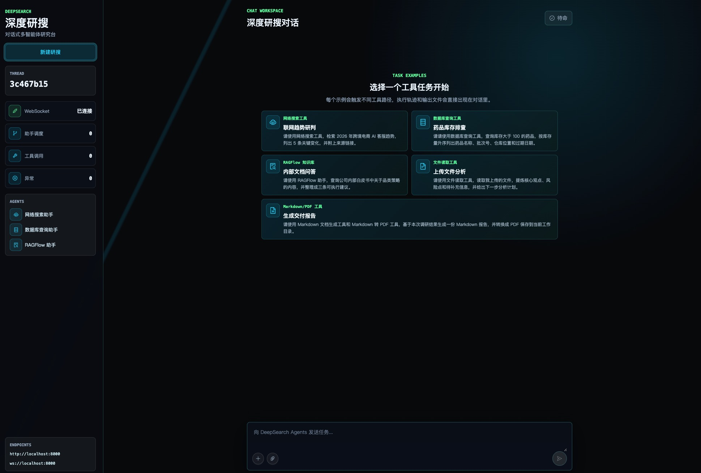
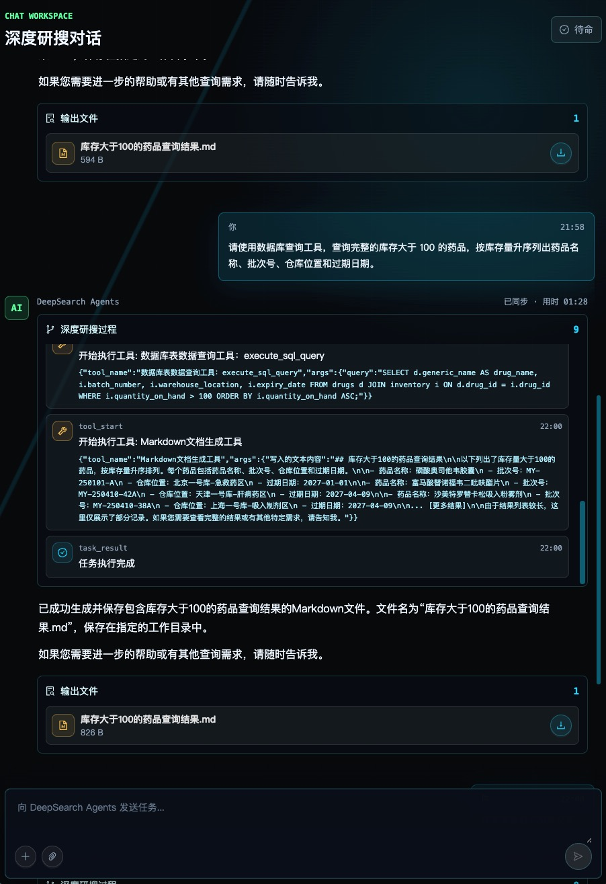

# deepsearch-agents

deepsearch-agents 是一个面向复杂研究任务的对话式多智能体系统。用户可以通过浏览器提交研究问题、上传参考文件，并实时查看任务执行过程。系统会根据任务内容调度不同的专业智能体，从公开网络、MySQL 数据库、RAGFlow 知识库和用户附件中收集信息，最后生成回答、Markdown 报告或 PDF 文件。



## 项目能力

- 多智能体协作：主智能体负责分析、规划、调度和汇总，专业智能体分别处理网络搜索、数据库查询和知识库检索。
- **反思循环**：每轮执行结束后由独立评估器判断信息是否足以回答原问题，不充分时识别缺口维度并驱动补充检索，最多迭代 3 轮（可通过环境变量调整），直到信息充分、轮数耗尽或 token 预算用尽。
- 多来源研究：支持结合公开资料、结构化业务数据、私有知识库和本地上传文件完成综合分析。
- 实时过程展示：后端通过 WebSocket 推送任务状态、智能体调用、工具调用、反思评估、结果和异常信息。
- **网络调用容错**：搜索等外部调用带「连接池重试 + 指数退避」，且失败时降级为可读错误交回模型决策（可换词重搜或改用其他信息源），不会因一次网络抖动作废整轮研搜；任务中途异常时保留已产出的部分结果并明确标注不完整。
- 文件输入与输出：支持读取常见办公文档和文本文件，并生成 Markdown 或 PDF 报告。
- 会话隔离：每次任务使用独立会话标识和输出目录，避免不同任务之间的数据相互干扰。
- 前后端分离：后端使用 FastAPI，前端使用 React、TypeScript、Vite 和 Ant Design。

## 工作流程

```text
用户提交任务或上传文件
        ↓
FastAPI 创建独立会话
        ↓
主智能体分析任务并制定执行计划
        ↓
调度网络搜索、数据库查询或 RAGFlow 知识库智能体
        ↓
汇总多来源信息，产出本轮结果
        ↓
反思评估器：信息是否足以回答问题？
   ├─ 充分 / 达到轮数上限 / token 预算耗尽 → 输出最终结果
   └─ 不充分 → 识别缺口维度，生成补充查询
              ↓
        携缺口指令重新进入主循环（复用同一会话上下文）
        ↓
通过 WebSocket 向前端推送执行轨迹、反思过程和生成文件
```

## 项目结构

```text
deepsearch-agents/
├─ app/
│  ├─ agent/              智能体配置、提示词、调度逻辑与反思循环
│  ├─ api/                FastAPI 接口与 WebSocket 服务
│  ├─ prompt/             提示词配置
│  ├─ ragflow/            RAGFlow 配置与调用示例
│  ├─ tools/              搜索、数据库、文件和知识库工具
│  ├─ utils/              路径处理与文档转换工具
│  └─ output/             任务生成的文件
├─ docker/
│  ├─ mysql/mysql.sql     MySQL 初始化数据
│  └─ docker-compose.yaml MySQL 容器配置
├─ docs/                  项目文档和界面图片
├─ examples/              独立功能示例
├─ frontend/              React 前端
├─ .env.example           后端环境变量示例
├─ pyproject.toml         Python 项目配置
└─ start.py               Windows 一键启动脚本
```

## 运行指南

### 1. 准备运行环境

需要安装以下软件：

- Python 3.12
- uv
- Node.js
- pnpm 10
- Docker Desktop（仅在使用项目自带 MySQL 时需要）

确认命令可以正常执行：

```bash
python --version
uv --version
node --version
pnpm --version
docker --version
```

### 2. 安装后端依赖

在项目根目录执行：

```bash
uv sync
```

该命令会根据 `pyproject.toml` 和 `uv.lock` 创建虚拟环境并安装依赖。

### 3. 安装前端依赖

```bash
cd frontend
pnpm install
cd ..
```

### 4. 配置环境变量

在项目根目录复制环境变量示例文件。

PowerShell：

```powershell
Copy-Item .env.example .env
```

macOS 或 Linux：

```bash
cp .env.example .env
```

打开 `.env` 并填写实际配置：

```dotenv
# 大模型
OPENAI_BASE_URL=兼容_OpenAI_协议的接口地址
OPENAI_API_KEY=你的大模型_API_KEY
LLM_QWEN_MAX=模型名称

# 网络搜索
TAVILY_API_KEY=你的_TAVILY_API_KEY

# 网络搜索容错（可选，留空使用默认值）
TAVILY_TIMEOUT=30
TAVILY_TRANSPORT_RETRIES=3
TAVILY_MAX_ATTEMPTS=2
TAVILY_BACKOFF_BASE=0.8
# 需要代理访问 Tavily 时才设置
# TAVILY_HTTP_PROXY=http://127.0.0.1:7890
# TAVILY_HTTPS_PROXY=http://127.0.0.1:7890

# RAGFlow
RAGFLOW_API_URL=你的_RAGFlow_服务地址
RAGFLOW_API_KEY=你的_RAGFlow_API_KEY

# MySQL
MYSQL_USER=root
MYSQL_PASSWORD=root
MYSQL_DATABASE=deepsearch_db
MYSQL_HOST=localhost
MYSQL_PORT=3307
MYSQL_CHARSET=utf8mb4
MYSQL_COLLATION=utf8mb4_unicode_ci
MYSQL_SQL_MODE=TRADITIONAL

# 反思循环（可选，留空使用默认值）
REFLECTION_MAX_ROUNDS=3
REFLECTION_TOKEN_BUDGET=150000
```

至少需要正确配置大模型接口和密钥。未配置 Tavily、MySQL 或 RAGFlow 时，对应的网络搜索、数据库查询或知识库能力将不可用。

### 5. 启动 MySQL

如果需要使用数据库查询功能，请先启动 Docker Desktop，然后在项目根目录执行：

```bash
docker compose --env-file .env -f docker/docker-compose.yaml up -d
```

首次启动时，`docker/mysql/mysql.sql` 会自动创建数据库并导入示例数据。

检查容器状态：

```bash
docker compose --env-file .env -f docker/docker-compose.yaml ps
```

不需要数据库查询功能时，可以跳过此步骤。

### 6. 启动后端

在项目根目录执行：

```bash
uv run uvicorn app.api.server:app --host 0.0.0.0 --port 8001 --reload
```

后端默认监听 `http://localhost:8001`。

### 7. 启动前端

新开一个终端窗口执行：

```bash
cd frontend
pnpm dev
```

前端默认监听 `http://localhost:5173`，并连接以下后端地址：

```text
API: http://localhost:8001
WebSocket: ws://localhost:8001
```

如需修改连接地址，请复制 `frontend/.env.example` 为 `frontend/.env.local`，再修改其中的配置：

```dotenv
VITE_API_BASE_URL=http://localhost:8001
VITE_WS_BASE_URL=ws://localhost:8001
```

### 8. Windows 一键启动

完成依赖安装和 `.env` 配置后，也可以在项目根目录执行：

```powershell
python start.py
```

启动脚本会检查本地环境、尝试启动 MySQL、分别启动前后端服务，并在前端就绪后打开浏览器。

### 9. 使用系统



打开前端页面后，可以直接输入研究任务，也可以先上传参考文件再提问。例如：

```text
分析数据库中的商品库存情况，并生成 Markdown 报告。
```

```text
搜索近期人工智能行业动态，并整理为 PDF 报告。
```

```text
读取我上传的行业资料，提炼关键结论并给出结构化摘要。
```

任务执行期间，页面会实时展示连接状态、智能体调度、工具调用、运行结果和生成文件。

## 停止服务

手动启动的前后端服务可以在对应终端中按 `Ctrl+C` 停止。

停止 MySQL 容器：

```bash
docker compose --env-file .env -f docker/docker-compose.yaml down
```

该命令会保留数据库数据卷，下次启动时可以继续使用现有数据。
